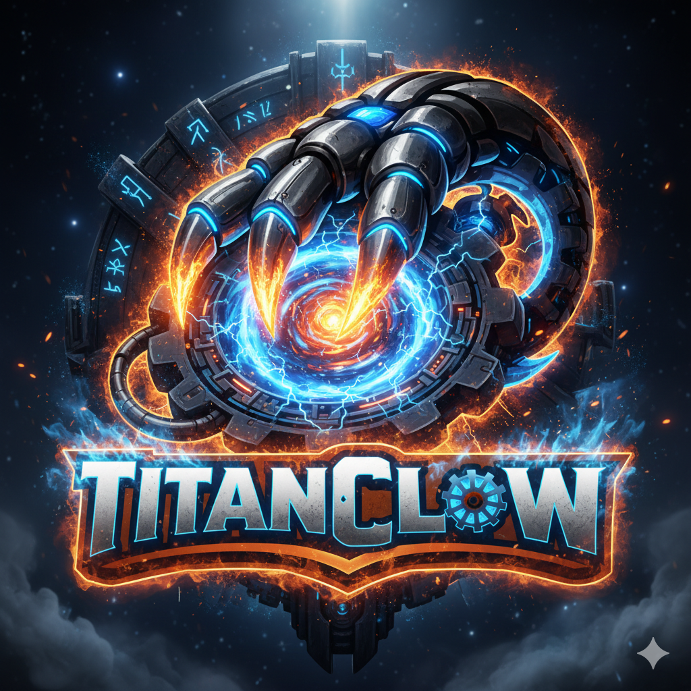

<p align="center">
  
</p>

<h1 align="center">TitanClaw</h1>

<p align="center">
  <strong>IronClaw, upgraded for secure high-throughput orchestration.</strong>
</p>

<p align="center">
  <a href="#why-titanclaw">Why TitanClaw</a> •
  <a href="#titan-upgrade-status">Titan Upgrade Status</a> •
  <a href="#capabilities">Capabilities</a> •
  <a href="#quick-start">Quick Start</a> •
  <a href="#architecture">Architecture</a> •
  <a href="#security-model">Security Model</a>
</p>

---

## Why TitanClaw

TitanClaw is a security-first AI runtime built for people who need real automation, not just chat.

It keeps your data under your control, runs tools in hardened sandboxes, supports multi-provider inference, and scales execution through concurrent jobs and isolated workers.

## Titan Upgrade Status

Based on `implementation_plan.md`, this is where the upgrade stands today.

| Track | Status | What is live now |
|---|---|---|
| Phase 0: provider independence + local inference | ✅ | NEAR AI, OpenAI-compatible, Ollama, Tinfoil, provider failover |
| Phase 0: orchestration foundations | ✅ | Scheduler, parallel jobs, Docker worker/orchestrator flow |
| Phase 0: secure extensibility | ✅ | WASM tool system, dynamic tool building, secure skills framework |
| Phase 0: streaming everywhere | ✅ | Gateway SSE/WebSocket exists; shell output streams live per chunk, tool-call deltas surface live shell command drafts, early piped shell execution is default-on (disable with `ENABLE_PIPED_TOOL_EXECUTION=false`), and approval-required commands emit explicit waiting status |
| Phase 0: reflex fast-path bypass | ✅ | Deterministic NL routing + persistent reflex pattern registry now route recurring prompts directly to compiled tools with LLM fallback |
| Phase 1: deep context indexing | ✅ | Tree-sitter AST indexing is live and queryable with `memory_graph` (bounded multi-hop traversal, graph scoring, stable ranking, semantic context fusion) |
| Phase 2: distributed swarm mesh | ✅ | Mesh node lifecycle is live, incoming swarm tasks execute via local tool/safety stack, scheduler tool subtasks offload to capability-matching peers, remote waiters are bounded/cleaned up, and local fallback is deterministic |
| Runtime reliability hardening | ✅ | Docker job containers now preflight the configured image and auto-pull on first use when `sandbox.auto_pull_image=true`, preventing first-run `No such image` failures |

## Capabilities

### What You Get Today

- Multi-provider LLM runtime with failover and retry logic
- Local-first memory with hybrid retrieval and persistent workspace context
- Secure WASM tool sandbox with capability gates and outbound allowlists
- Dynamic tool creation pipeline for runtime expansion
- Web gateway with WebSocket + SSE for real-time interaction
- Jobs tab now supports direct manual job creation (task + mode) for faster sandbox testing
- Routines/automation engine for scheduled and event-driven tasks
- Full-job routines execute through the real scheduler pipeline (multi-step), not lightweight fallback
- Docker-isolated workers for higher-risk or heavier executions
- First-run Docker image preflight + auto-pull for container jobs
- One-click sandbox artifact export as downloadable archive from the Jobs UI
- Web chat lifecycle controls (delete single thread, clear all chats)
- OpenAI-compatible API endpoints for external integration
- LLM-bypassed fast-path for common job ops in natural language
- Persistent reflex pattern routing from recurring prompts to compiled tools
- AST graph symbol query via `memory_graph` for indexed Rust code relationships (with bounded multi-hop traversal)
- Live shell command draft previews from streamed tool-call deltas (`[draft] ...`)
- Shadow-worker speculative response cache for likely follow-up prompts (bounded + TTL)
- Kernel monitor runtime loop for slow-tool detection with optional JIT patch deploy pipeline

### Current TODO

- [x] Zero-latency text streaming to channels
- [x] Shell tool incremental output streaming
- [x] Deterministic NL fast-path bypass for common job intents
- [x] AST graph indexing + query access (`memory_graph`)
- [x] Generalized reflex routing from recurring patterns
- [x] Multi-hop GraphRAG quality hardening
- [x] Token-to-tool piped execution completion (default-on with approval-aware piped status)
- [x] Swarm task distribution from scheduler tool subtasks into mesh peers (with remote-result routing and local fallback)

### Built For Operators

- Strong defaults for prompt-injection resistance and secret handling
- Auditability and explicit approval flows for sensitive actions
- CLI + service model for persistent local operation
- Rust-native performance with a single deployable binary

## Quick Start

### Prerequisites

- Rust `1.92+`
- PostgreSQL `15+` with `pgvector` (recommended)
- Optional: Ollama for local inference

### Install

Use TitanClaw release assets:

- Windows MSI: `https://github.com/PhantomReaper2025/titanclaw/releases/latest/download/titanclaw-x86_64-pc-windows-msvc.msi`
- PowerShell installer: `irm https://github.com/PhantomReaper2025/titanclaw/releases/latest/download/titanclaw-installer.ps1 | iex`
- Shell installer: `curl --proto '=https' --tlsv1.2 -LsSf https://github.com/PhantomReaper2025/titanclaw/releases/latest/download/titanclaw-installer.sh | sh`

Or build from source:

```bash
git clone https://github.com/PhantomReaper2025/titanclaw.git
cd titanclaw
cargo build --release
```

### First Run

```bash
# Interactive setup wizard
./target/release/titanclaw onboard

# Start agent runtime (default command)
./target/release/titanclaw run
```

Onboarding captures default sandbox coding runtime and OpenCode model defaults. OpenCode mode now runs through a dedicated bridge runtime (`opencode-bridge`) in sandbox jobs.

Advanced runtime knobs:

- `SHADOW_WORKERS_ENABLED` (`true`/`false`)
- `SHADOW_MAX_PREDICTIONS` (default `3`)
- `SHADOW_CACHE_TTL_SECS` (default `900`)
- `SHADOW_MAX_PARALLEL` (default `2`)
- `KERNEL_MONITOR_ENABLED` (`true`/`false`)
- `KERNEL_MONITOR_INTERVAL_SECS` (default `180`)
- `KERNEL_SLOW_THRESHOLD_MS` (default `5000`)
- `KERNEL_AUTO_APPROVE_PATCHES` (`true`/`false`)
- `KERNEL_AUTO_DEPLOY_PATCHES` (`true`/`false`)

Kernel patch management interfaces:

- Tool: `kernel_patch` (`list|approve|reject|deploy`)
- Chat command (all channels, including Telegram): `/kernel list`, `/kernel approve <uuid>`, `/kernel reject <uuid>`, `/kernel deploy <uuid>`
- Gateway API:
  - `GET /api/kernel/patches`
  - `POST /api/kernel/patches/{id}/approve`
  - `POST /api/kernel/patches/{id}/reject`
  - `POST /api/kernel/patches/{id}/deploy`

### Getting Generated Projects Out Of Sandbox

- Open the Jobs tab in the web UI.
- Open any job detail and click `Download Archive` to export project output to your machine.
- You can still use `Browse Files` for direct host-path browsing.

### Useful Commands

```bash
# Health and diagnostics
./target/release/titanclaw status
./target/release/titanclaw doctor

# Tool and memory management
./target/release/titanclaw tool --help
./target/release/titanclaw memory --help
./target/release/titanclaw memory bootstrap --dry-run
./target/release/titanclaw memory bootstrap

# Service management
./target/release/titanclaw service --help
```

On startup, TitanClaw now safely refreshes core workspace docs (`AGENTS.md`, `IDENTITY.md`, `SOUL.md`, `USER.md`, `MEMORY.md`, `HEARTBEAT.md`, `README.md`) when they are missing, legacy, or managed-and-outdated.

### Swarm Mesh (Experimental)

Enable the distributed Hive mesh runtime:

```bash
export SWARM_ENABLED=true
export SWARM_LISTEN_PORT=0
export SWARM_HEARTBEAT_INTERVAL_SECS=15
export SWARM_MAX_SLOTS=4
./target/release/titanclaw run
```

## Architecture

```text
Channels (CLI / Web / Webhooks / WASM Integrations)
          |
          v
Agent Loop + Router
          |
          +--> Scheduler (parallel task execution)
          |
          +--> Routines Engine (cron/event/webhook)
          |
          +--> Tool Registry (built-in + WASM + MCP)
          |
          +--> Orchestrator --> Docker Workers (isolated execution)
          |
          +--> Workspace + Hybrid Memory Store
```

For roadmap detail and rollout context, see `implementation_plan.md`.

## Security Model

Defense-in-depth is a core design constraint, not an add-on.

- WASM capability sandbox for untrusted tools
- Request/response scanning and policy checks for exfiltration patterns
- Secrets injected at host boundary instead of exposing raw credentials to tools
- Endpoint allowlisting for outbound network activity
- Isolation layers: in-process controls plus optional Docker worker boundaries

## Development

```bash
cargo fmt
cargo clippy --all --benches --tests --examples --all-features
cargo test
```

`Dockerfile.worker` now installs both Claude Code and OpenCode CLIs for sandbox runtime selection.

If you modify channel source packages, run `./scripts/build-all.sh` before a release build.

## Project Lineage

TitanClaw is built on IronClaw's Rust architecture and follows `implementation_plan.md` for upgrade execution.

## License

Licensed under either:

- Apache License, Version 2.0 (`LICENSE-APACHE`)
- MIT License (`LICENSE-MIT`)

at your option.
